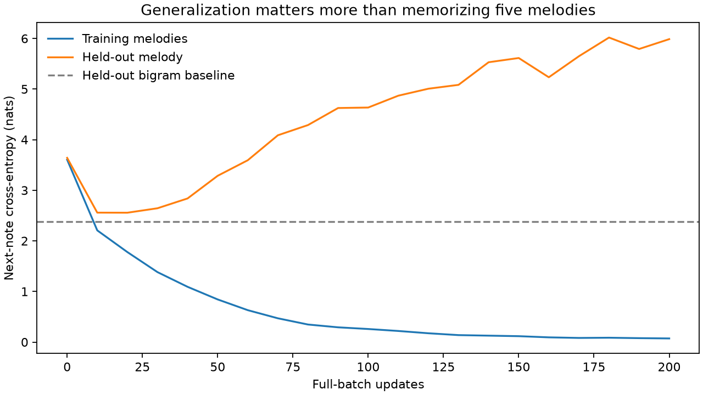

# Transformer melody generation

A readable TensorFlow next-note model with causal attention, reproducible
training, saved-model inference, and MIDI export. The experiment also shows
why a model that memorizes melodies is not necessarily a good composer.



## Reproduce it

Python 3.13, CPU, no downloads or API keys beyond package installation:

```bash
python -m venv .venv
source .venv/bin/activate
python -m pip install -r requirements-reproduce.txt
python -m unittest -v test_melody
python train.py --epochs 200 --seed 7
```

Outputs in `results/`: numerical history, learning curve, model configuration,
tokenizer, reloadable weights, and two MIDI files. CI reruns the experiment and
attaches the complete directory, including weights. Weights are not committed.
The dependency versions are pinned; GPU/platform floating-point differences may
still change sampled notes or exact metrics.

**Try the outputs:** [sampled continuation](results/sampled.mid) ·
[greedy continuation](results/greedy.mid) · [all notes and metrics](results/metrics.json).
Download a MIDI file and open it in a DAW or notation program. These are small
educational examples, not claims of production-quality compositions.

## Measured result: memorization is not generalization

The six bundled melodies are split by **whole melody**, never by overlapping
windows. Melody 0 is held out; the other five provide the vocabulary and training
examples. Melody 0 was chosen because its note tokens are present in the training
vocabulary. There is no tuning or checkpoint selection on held-out scores.

| Model / evaluation | Next-note cross-entropy ↓ | Perplexity ↓ | Accuracy ↑ |
|---|---:|---:|---:|
| Transformer, training melodies, update 200 | 0.072 | 1.07 | 97.0% |
| Transformer, held-out melody, update 200 | 5.987 | 398.19 | 14.8% |
| Add-one-smoothed bigram, same held-out melody | 2.379 | 10.80 | 37.0% |

Seed 7, one full batch per update, one layer per stack, width 32, two heads,
dropout 0.1, Adam learning rate 0.003 with norm clipping. The fixed 200-update
run intentionally exposes overfitting. These results cover only **one held-out
tune**, not a statistically reliable music benchmark. The next research step is
a larger, licensed melody corpus with separate validation and test sets, not
increasing model size on these six examples.

## Correctness improvements

- **Exactly one target shift.** At position t, the label is the next note, not
  the note two steps ahead. Each tune contributes one right-padded example.
- **No future-token leakage.** Both encoder and decoder self-attention are
  causal, as is cross-attention. Because both stacks read the same prefix, a
  conventional bidirectional translation encoder would leak future labels.
- Padding cannot become a sampled note; padded targets do not enter the loss.
- Attention head width is `d_model / num_heads`, and sinusoidal dimensions
  alternate sine/cosine, including for odd widths.
- Seeded top-k sampling, greedy decoding, known-token and length validation.
- Checkpoint + tokenizer + architecture round trip reproduces logits exactly
  in the reference run (maximum absolute difference **0**).

Seven tests cover causality through both stacks, padding invariance, label
alignment, positional encoding, seeded generation, checkpoint reload, and MIDI
pitches/timing. The original architecture's weights are not compatible with the
corrected head dimensions; retrain instead of silently loading old checkpoints.

## Generate from saved weights

```python
from train import load_artifact
from melodygenerator import MelodyGenerator, write_midi

model, tokenizer = load_artifact("results")
generator = MelodyGenerator(model, tokenizer, max_length=32)
notes = generator.generate(["C4-1.0", "D4-1.0", "E4-1.0"],
                           temperature=0.8, top_k=5, seed=19)
write_midi(notes.split(), "results/my-melody.mid", bpm=100)
```

The representation is `pitch-duration`, with duration in quarter-note beats.
There are no rests, polyphony, expressive timing, or end-of-sequence token yet;
generation stops at the requested length.

## Files and attribution

- `transformer.py`: causal two-stack architecture and positional encoding.
- `melodypreprocessor.py`: explicit note vocabulary and shifted pairs.
- `train.py`: fixed split, baseline, evaluation, checkpoint and experiment.
- `melodygenerator.py`: inference and MIDI export.
- `dataset.json`: the original six symbolic melody examples.

Based on melody-generation material from
[The Sound of AI](https://www.youtube.com/@ValerioVelardoTheSoundofAI).
Mask semantics follow the [Keras MultiHeadAttention documentation](https://keras.io/api/layers/attention_layers/multi_head_attention/).
